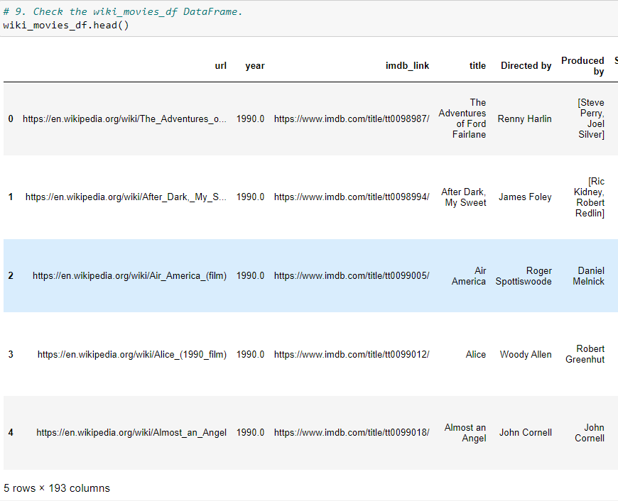
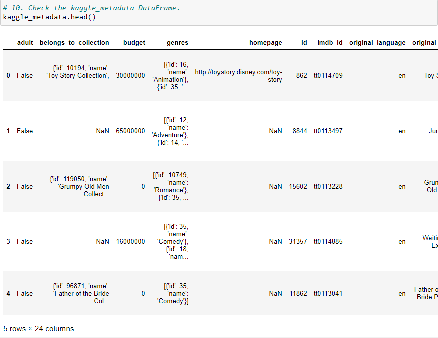
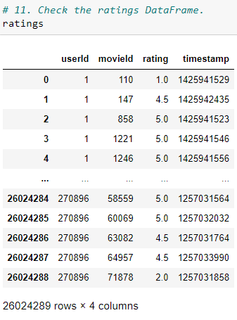

# Movies-ETL

## Project Overview
Amazing Prime loves the dataset and wants to keep it updated on a daily basis. Britta needs your help to create an automated pipeline that takes in new data, performs the appropriate transformations, and loads the data into existing tables. You’ll need to refactor the code from this module to create one function that takes in the three files—Wikipedia data, Kaggle metadata, and the MovieLens rating data—and performs the ETL process by adding the data to a PostgreSQL database.
For this analysis, we were tasked to do the following:
1. write an ETL function to read three data files
2. extract and transform the Wikipedia data
3. extract and transform the Kaggle and rating data
4. load the data to a PostgreSQL Database called movie_data

## Resources
- Data Source: wikipedia-movies.json, movies_metadata.csv, ratings.csv
- Software: Python 3.7.7, Anaconda Navigator 1.9.12, Conda 4.8.4, Jupyter Notebook 6.0.3, PostgreSQL 11.9, pgAdmin 4

## Results

### Write an ETL function to read three data files
The function takes the Wikipedia JSON, the Kaggle metadata and MovieLens csv files and creates three separate DataFrames.

### Extract and Transform the Wikipedia data
We filtered out the TV shows, consolidated the redundant data, removed the duplicates and formatted the Wikipedia data.

### Extract and Transform the Kaggle and rating data
Again, we consolidated the redundant data, removed the duplicates, formatted and grouped the data.\
The Kaggle and rating data were then merged with the Wikipedia movies DataFrame.

### Load the data to a PostgreSQL Movie Database
![movies_sql_database.png]

## Summary
The ETL function created collects and cleans movie data from different sources (Wikipedia JSON and Kaggle and ratings csv files). It transforms and merges the data and loads it into two updatable PostgreSQL dataset tables ready to be used for analysis.